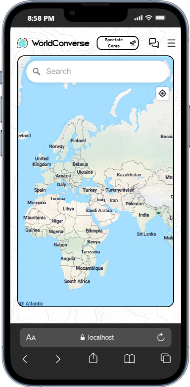
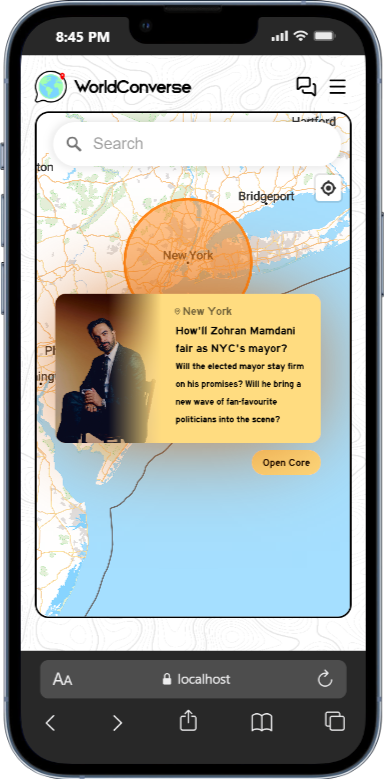
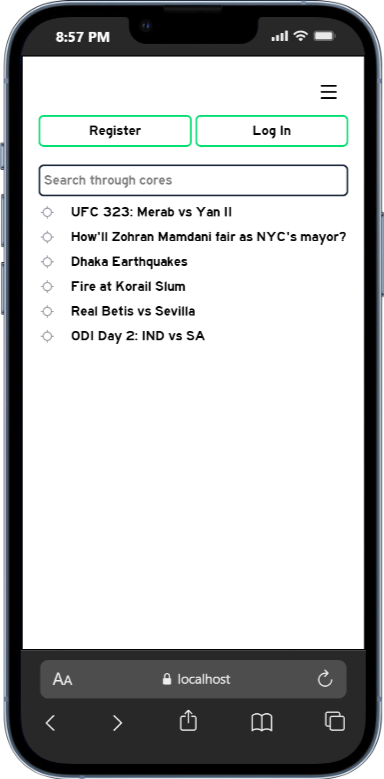
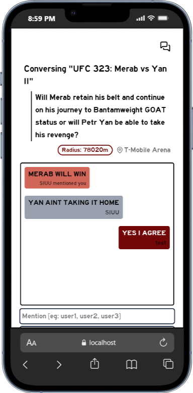
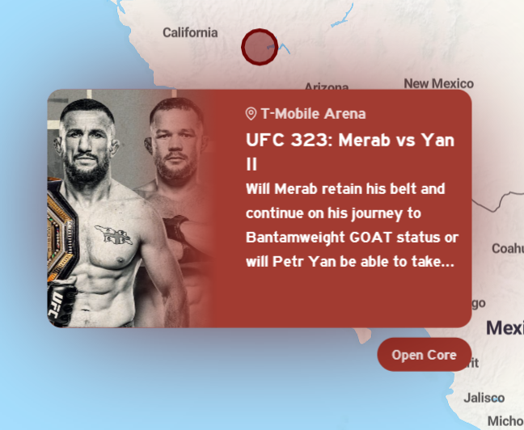
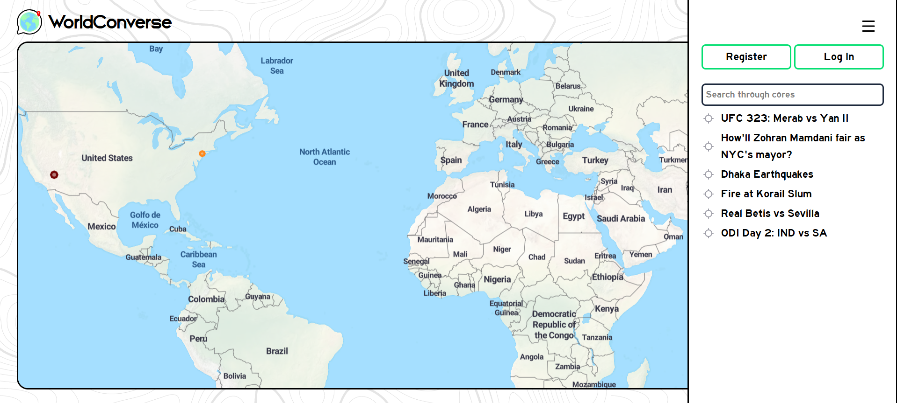
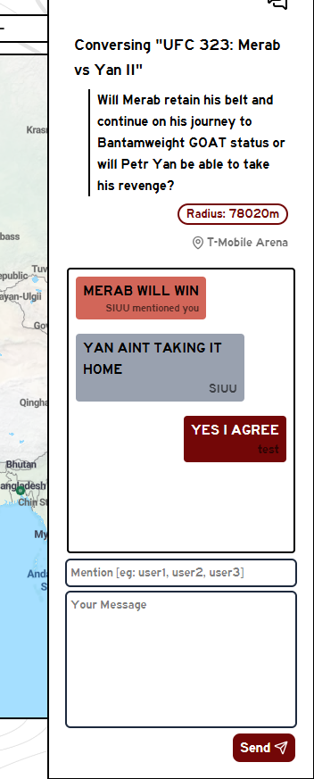
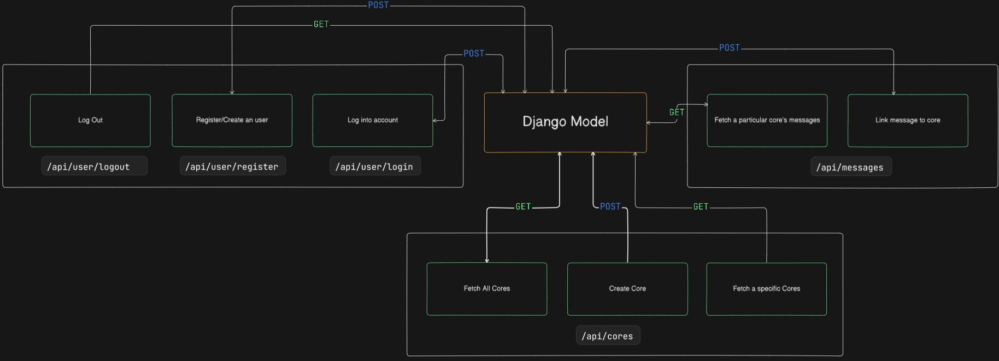

# WorldConverse 🌏
  
 

## What is it?
- A site that allows you converse, in realtime, to people around the world with shared interests, building up a **Core**
    - Core is a circle on map - initially 200m radius
    - The core **enlarges** as more and more people join the core (join as in have at least 1 message in core)
    - Larger the core, the higher up on the list on sidebar
- It's a **combination of all** top-tier social medias - that's what makes it distinct

| Top Social Platforms | WorldConverse |
|:-----------:|:------------:|
|Twitter/X: Allows you to share your views to the world|✅|
|Whatsapp: Realtime Chat|✅|
|Discord/Reddit: Servers/subreddits focused on a specific topic|Cores ✅|

## Demonstration
- Works **both** on mobile 📱 and desktop 🖥️
  
| Mobile Home Page | Mobile Core | Mobile Sidebar | Mobile Chatbar |
|:------------------:|:--------------------:|:--------------------:|:--------------------:|
|  |  |  |  |

| Desktop Home Page | Desktop Core | Desktop Sidebar | Desktop Chatbar |
|:------------------:|:--------------------:|:--------------------:|:--------------------:|
|  |  |  |  |

## Breakdown of the project
- The frontend and backend are decoupled. They work in parallel.
- React was used instead of vanilla JS, so had to take into account virtual DOMs, React trees, context providers (for state-sharing between components)
- The pages are static/server rendered, this helps with SEO
- Customised the [OpenFreeMap](https://openfreemap.org/) theme
- Added custom popups instead of using [MapLibre](https://maplibre.org/)'s ones
    - Popup changes textcolor to black if light background and vice versa automatically

### Frontend
- There are 3 routes
    - `/`, this is where one'll be using the site, this is where the map resides
    - `/login` and `/register` are self-explanatory
        - If not logged in, users can't make cores. Only spectate. They can see the conversations though, but not partake in them.
- The components are what make up the frontend
    > global_provider.jsx
    - This is what allows sharing of states between components 
    > card.jsx
    - This is the popup that appears when you click on a core
    - It consists of an image, title, location name of where the core is centered, description and a button to open the core
        - That button activates the chatbar
    > chat.jsx
    - This holds the chatbar, i.e. chat on sidebar
    - Upon joining a core, this is where you'll be able to see past conversations and also converse with other people regarding the topic of that particular core
    - Includes ability to mention, highlights text bubble if mentioned
    - Always matches the color scheme of the core
    > header.jsx
    - This holds the sidebar and chatbar's activators, through them, the openState of each is updated
    - It also holds a button that lets you toggle between the ability of making a core or just spectating all cores
    > sidebar.jsx
    - Has the buttons that allow you to Login, Register or Logout
    - Has a search bar through which you can search for cores that are regarding a topic you want to converse about
        - Clicking on the results will fly you to the core
        - The default search list is arranged in descending order of radius
    > map.jsx
    - This contains the map
        - The map has a search bar that flies you to locations you search up and make cores there
        - It also has a "Locate Yourself" button so that you can make a core if there's something interesting happening in your locality
    - Has the input window through which cores are made
    - Has functions:
        - that upload core's details to DB
        - that draws core upon input window's fields are filled up and submitted
            - through this we link popups via createPortal instead of createRoot (as createRoot makes a separate tree, thus global context lost)
        - that allow flying to a particular location
### Backend
- The communication to backend from frontend is via HTTP requests
- Basically, an API. The following shows how to make requests:
    
- The following shows the Django Models and how they are related:
    
> There are two capitalised variables in the project files that you can tune to for your liking - BASE_RADIUS, INCREASE_FACTOR
